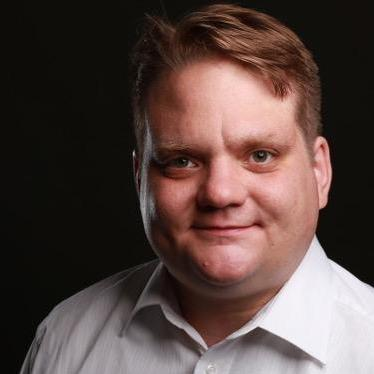

Matthias Leuffen is focusing on cloud-native collaborative platforms implementing 
agile development strategies in open-source communities.

## Interests

- Agile product development
- Agile team setups / eXtreme Programming
- Scalable high available cloud infrastructure
- Business automation
- Open source mindset

## Maintainer

- **[infracamp](https://infracamp.org)**: Open source incubator
- **[text/template](https://packagist.org/packages/text/template)**: Template system for PHP
- **[Phore Framework](https://github.com/phore)**:  IoT and big-data microservice framework
- **[kickstart](https://github.com/infracamp/kickstart)**: Language agnostic container based rapid development environment

## Stations

- 2021: Cloud architect / team lead IIoT platform *(Talpasolutions GmbH)*
- 2018: Team lead web-engineering *(Continue Software GmbH)*
- 2012: BA Business studies *(FH Aachen)*
- 2006: <a href="https://leanea.de">Freelancer web-development / operations</a>
- 2000: Abitur *(Norbert Gymnasium Knechtsteden)*

## Speaker

- ITSMF 2018: "*Fachkräftemangel im IT Konzern*"
- IT Sicherheitskonferenz 2018: "*Muss der Admin alles können dürfen?*"

## Contact

Matthias Leuffen - Mathildenstr. 9-11 - 45130 Essen - m@tth.es - Germany

[see page source](https://github.com/dermatthes/leuffen.de)
