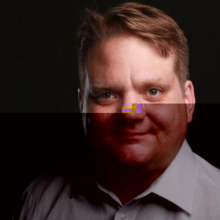

## Interests

- Agile product development
- Agile team setups
- Scalable high available cloud infrastructure
- Business automation

## Maintainer

- **[infracamp](https://infracamp.org)**: Open source incubator
- **[text/template](https://github.com/dermatthes/text-template)**: A simple template system for PHP
- **[Phore Framework](https://github.com/phore)**: Microservice framework for IoT and big-data.
- **[kickstart](https://github.com/infracamp/kickstart)**: Container based rapid development environment

## CV

- now: Cloud Architect / team lead IIoT platform (Talpasolutions GmbH)
- 2018: Team lead web-engineering (Continue Software GmbH)
- 2012: BA Business studies (FH Aachen)
- 2006: Freelancer web-development / operations
- 2000: Abitur (Norbert Gymnasium Knechtsteden)

## Conferences

- ITSMF 2018: "Fachkräftemangel im IT Konzern"
- IT Sicherheitskonferenz 2018: "Muss der Admin alles können dürfen"

## Contact

Matthias Leuffen - Viehofer Str. 31 - 41057 Essen - m@tth.es - Germany
